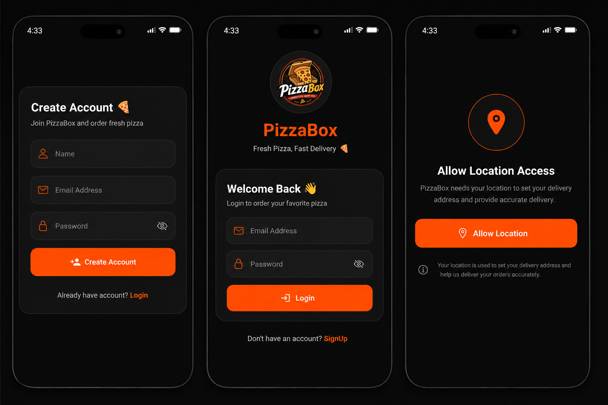
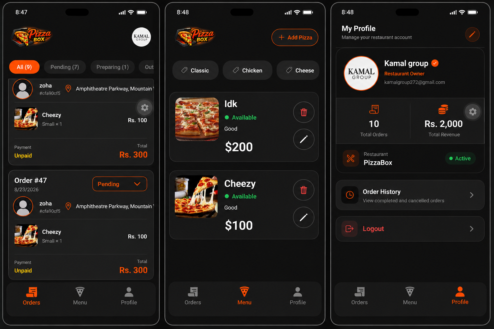
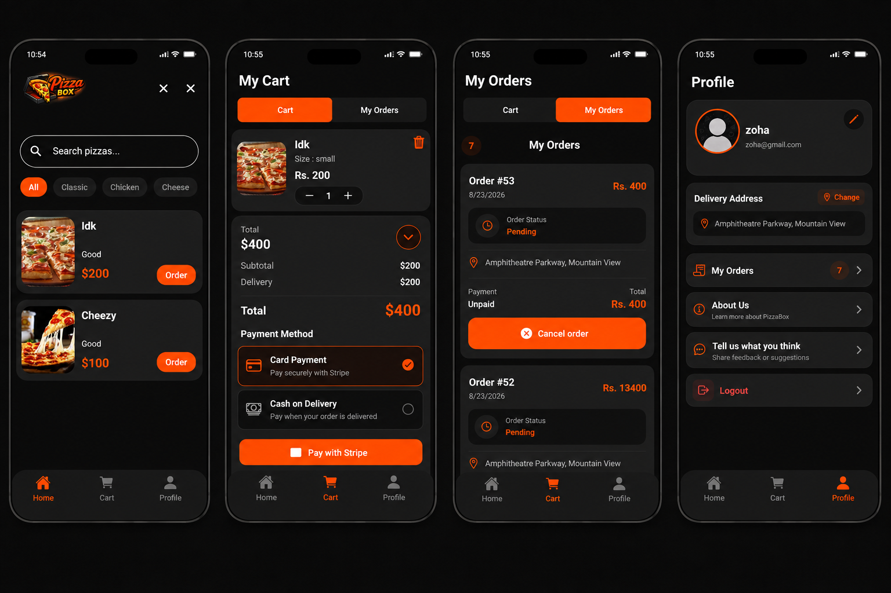

# 🍕 PizzaBox

**PizzaBox** is a full-stack pizza ordering mobile application built with **React Native and Expo**. It provides separate **Customer** and **Admin** experiences with authentication, pizza management, cart, orders, Stripe payments, and a Supabase backend.

---

## ✨ Features

### 🔐 1. Authentication

PizzaBox uses **Supabase Authentication** with role-based navigation.

**Authentication Flow:**

```text
                    🔐 Authentication
                           │
                    Login / Sign Up
                           │
                    ┌──────┴──────┐
                    │             │
                 👨‍💼 Admin      👤 Customer
                    │             │
                    ▼             ▼
               Admin Tabs    Check Location
                                  │
                         ┌────────┴────────┐
                         │                 │
                    📍 Location       📍 Location
                      Exists            Missing
                         │                 │
                         ▼                 ▼
                   Customer Tabs    Location Setup
                                          │
                                          ▼
                                    Customer Tabs
```

* 👨‍💼 **Admin** → Login → **Admin Tabs**
* 👤 **Existing Customer** → Login → Location already saved → **Customer Tabs**
* 👤 **New Customer** → Sign Up → **Location Setup** → **Customer Tabs**
* 📍 **Customer without Location** → Login → **Location Setup** → **Customer Tabs**

---

### 👤 2. Customer Features

After authentication, customers can:

* 🍕 **Browse Pizzas** — View pizzas with categories, sizes, prices, and images
* 🛒 **Shopping Cart** — Add pizzas, select sizes, update quantities, and remove items
* 💳 **Payments** — Pay securely with Stripe or choose Cash on Delivery
* 📦 **Place Orders** — Create and view orders
* 🚚 **Order Tracking** — Track the current status of orders
* ❌ **Cancel Orders** — Cancel eligible pending orders
* 👤 **Profile** — View and manage customer profile information

---

### 👨‍💼 3. Admin Features

Admins have a dedicated admin panel for managing the application:

* 🍕 **Pizza Management** — Add, edit, and manage pizzas
* 🏷️ **Category Management** — Manage pizza categories
* 💰 **Price Management** — Set prices for different pizza sizes
* 🖼️ **Image Management** — Upload and manage pizza images
* 📦 **Order Management** — View customer orders
* 🔄 **Order Status Management** — Update customer order status

---

## 🛠️ Tech Stack

| Category          | Technologies                                                         |
| ----------------- | -------------------------------------------------------------------- |
| **Frontend**      | **React Native · Expo · Expo Router · Zustand**                      |
| **Backend**       | **Supabase · PostgreSQL · Supabase Auth · Storage · Edge Functions** |
| **Payments**      | **Stripe**                                                           |
| **Local Storage** | **AsyncStorage**                                                     |

---

## 📱 App Screenshots

### 🔐 Authentication

<p align="center">
  
</p>

**Flow:** Login / Sign Up → Role Check → Admin or Customer

---

### 👨‍💼 Admin

<p align="center">
  
</p>

**Flow:** Admin Login → Admin Tabs → Manage Pizzas, Categories & Orders

---

### 👤 Customer

<p align="center">
  
</p>

**Flow:** Login / Sign Up → Location Check → Location Setup if required → Customer Tabs

---

## 📁 Environment Setup

Create a `.env` file in the project root and add your Supabase and Stripe keys.

```env
EXPO_PUBLIC_SUPABASE_URL=your_supabase_url
EXPO_PUBLIC_SUPABASE_PUBLISHABLE_KEY=your_supabase_publishable_key
EXPO_PUBLIC_STRIPE_PUBLISHABLE_KEY=your_stripe_publishable_key
```

> ⚠️ **Never commit your `.env` file or secret API keys to GitHub.**

---
